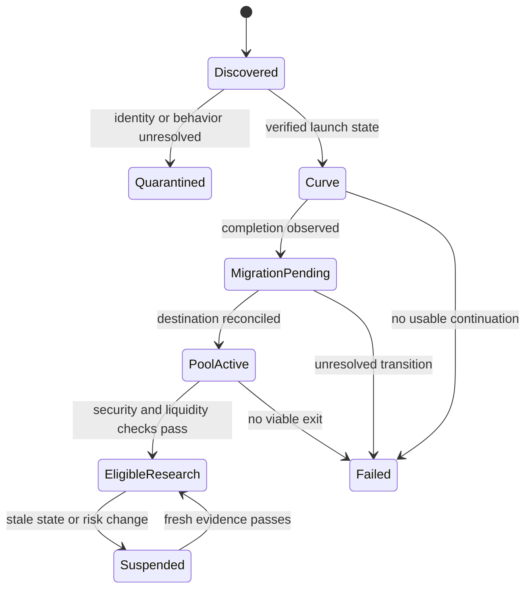

<!-- From the Jarvus Terminal's knowledge pack (research edition 2.0, reviewed 28-29 Sept 2026). Imported unchanged. The 14 memecoin hypotheses that could be backtested were all negative after costs (terminal-evidence.md section 3); the rest need on-chain data (strategy-library-untested.md). -->

# Memecoin trading: research and software handbook

Edition 2.0 • Sources reviewed September 28–29, 2026 UTC

This expansion adds a structured way to research meme assets, rather than promising a winning coin or bot. The combined catalogue has **320 records: 302 trading hypotheses and 18 supporting model, execution, or risk-filter records**. There are **200 memecoin-specific records**, of which **197 are trading hypotheses**. The original stock/crypto foundations remain in `Day_Trading_Handbook.md`; twenty additional stock setups appear at ST301–ST320.

These are formalized research ideas, including clearly labeled variants. They are not 302 independent discoveries, 302 published systems, or 302 strategies demonstrated to make money. No market dataset was backtested in this task. Expected returns and win rates remain null. Fixed values in examples are test fixtures or illustrative experiment choices, not trading recommendations.

## 1. What “every memecoin” can mean for software

A complete permanent list does not exist: tokens launch, disappear, migrate, change classifications, and share names. Private strategies are not fully observable either. The useful objective is a **versioned discovery process with measurable coverage**, followed by token-level evidence and reproducible experiments.

Use three universes, kept separately:

| Universe | Discovery route | What it misses |
|---|---|---|
| Vendor-listed meme assets | A versioned category plus stable provider coin IDs | Unlisted launches, delayed classifications, deleted failures |
| Recently created pools | Per-network new-pool feeds and permitted protocol event indexing | Tokens without pools; provider or plan limits; older history |
| Observed chain deployments | Successful creation events from supported programs/contracts | Unsupported programs, missing archive history, ambiguous meme classification |

CoinGecko's listed-market API supports category filtering and pagination. Its new-pool endpoint is different: reviewed documentation describes a recent 48-hour window, up to 20 pools per page, and plan-dependent pagination beyond ten pages. An exhausted accessible page range therefore does not establish a chain-wide census. DEX Screener exposes distinct profile, advertising, boost, and takeover-related discovery surfaces; none should be interpreted as “all safe new tokens.” [S49–S51, S76]

Store the network, provider, first/last observation, requested and successful pages, cursor, covered time interval, known caps, failed requests, and raw-response hashes. Report `partial`, `unknown`, or `complete_within_declared_scope`; never simply `all_memecoins=true`. Current membership is not historical membership. Keep failed and delisted tokens in the research archive.

Illustrative labels observed in the reviewed vendor category include Dogecoin, Shiba Inu, Pepe, Bonk, dogwifhat, Fartcoin, FLOKI, Pudgy Penguins, Official Trump, SPX6900, Turbo, and BOOK OF MEME. These are discovery examples, not recommendations or verified trade identities. The category also includes representations and platform-associated assets, so its definition should not silently become your economic taxonomy. No current prices or contract addresses are supplied as trade-ready facts. [S48]

The accompanying `universe_discovery_spec.json` is a specification, not a completed live census. Actual deployment identities, permissions, and quotes still need to be collected and verified.

## 2. Separate the asset, its representations, its pools, and its instruments

The permanent key for a token deployment is the chain/network and contract or mint identity. A native asset needs an explicit native identifier. A wrapped or bridged representation is another instrument with its own issuer, redemption, bridge, liquidity, and contract risks. A ticker is an alias; a logo, address suffix, website, and community name do not authenticate the asset.

One token can have many pools and centralized markets. A pool can use a volatile quote currency. A perpetual referencing a token is a derivative, not ownership of the token. A platform's own token is not interchangeable with every meme launched on that platform. A vendor category may group these together for discovery, but execution and risk accounting must separate them.

For every proposed trade, resolve:

1. The exact asset and representation.
2. The exact pool, venue, or derivative contract.
3. Quantity decimals, lot/step sizes, price units, quote and collateral currency.
4. The version of token behavior and pool logic currently in force.
5. The actual route used to acquire and liquidate the intended size.

ERC-20 defines an interface, not a safety certificate. Its specification includes optional metadata methods and requires callers to handle unsuccessful returns. Different compatible implementations can have different restrictions and privileges. [S75]

## 3. A launch is a sequence of market states



Graduation is a platform event, not certification of economic quality. A completion flag, a migration transaction, an indexed pool, a working quote, and a successful sale are different observations. A chart may draw a continuous series across them even though a trader could not transact continuously.

Pump's documentation illustrates why integrations must be versioned: recent material describes revised trade interfaces, quote-mint handling, reward flags, and effective pricing reserves. An announcement of support is not proof every advertised feature is active for the asset being traded. The older bonding-curve description must be reconciled with current interfaces and deployed state. [S56, S57]

Raydium LaunchLab similarly describes curve trading followed by migration to a configured AMM. Do not apply one platform's threshold, destination, fee schedule, or LP treatment to another. The software must decode the actual lifecycle, not recognize a familiar chart shape. [S58]

## 4. Market cap does not tell you what an exit is worth

Displayed valuation multiplies a marginal price by a supply measure. Liquidation consumes available counterparties or pool reserves. These are different calculations.

For an illustrative standard constant-product pool with token reserve `x`, quote reserve `y`, token input `q`, and an input fee fraction `f`, under the stated simplified model:

```text
effective_input = q × (1 − f)
quote_output = y × effective_input / (x + effective_input)
post_trade_token_reserve = x + q
post_trade_quote_reserve = y − quote_output
```

This assumes the fee stays in the input reserve, no transfer taxes, no unusual hooks, no virtual reserves, and no concurrent trades. It is an educational model, not a universal DEX quoter. Concentrated ranges, discrete bins, alternate fee collection, and protocol-specific curves require their own state-aware mathematics. Uniswap v3's bounded ranges and Meteora's bin distributions illustrate that distinction. [S22, S59, S74]

**Synthetic example:** a pool contains 1,000,000 tokens and 10,000 quote units. Its marginal reference is 0.01 quote per token. With total supply of one billion, this price implies a ten-million-unit fully diluted valuation. Selling another 1,000,000 tokens into the pool at a 0.3% input fee yields approximately **4,992.49 quote units**, before any other costs. It does not yield the 10,000 units suggested by multiplying the inventory by the initial marginal price, much less any large fraction of FDV.

Value a proposed position using a full-size exit quote, its freshness, route composition, minimum output, and a stressed alternative. Include a zero-proceeds scenario where transfer restrictions or vanished liquidity make an exit impossible. Do not manufacture a precise liquidation value when routes or state are unknown.

## 5. Screening has hard gates and uncertain evidence

The file `memecoin_screening_rules.json` separates blocking conditions from diagnostic flags. Passing all checks means “eligible for the specified research process at this time,” not “safe” or “profitable.” A scanner score must not become a probability unless it has been calibrated on an appropriate future-time sample.

| Area | Required evidence | Common false reassurance |
|---|---|---|
| Identity | Chain deployment and independent provenance | Matching ticker, logo, or address suffix |
| Permissions | Capability graph, implementation version, update controls | “Ownership renounced” |
| Transfers | Current intended-wallet, intended-size route behavior | A tiny buy or a past successful sale |
| Liquidity | Executable exits and verified withdrawal rights | High FDV or one locked LP position |
| Holders | Economic ownership estimates and uncertainty | Thousands of addresses |
| Demand | Deduplicated outside purchases and fees | Large raw volume |
| Information | Original receipt time and revision history | A screenshot or an edited post |
| Access | Actual account, venue, and instrument permissions | A market symbol exists somewhere |

Solana token accounts and mint capabilities differ. Token extensions add behaviors that a generic token parser may miss. A permanent delegate and transfer-hook logic are examples of capabilities that need separate evaluation. The absence of a normal mint authority is therefore not an all-clear. [S52–S55]

On EVM systems, inspect ownership, roles, proxies, external dependencies, and fee/blacklist controls. Removing one `onlyOwner` privilege does not remove every other authority. Pool hooks can also affect swap and liquidity behavior. [S65, S66]

Honeypot.is documents separate simulation status, classification, tax, and holder-analysis fields; some can be absent. Preserve that distinction. A failed scanner call means unknown. A successful simulation describes the tested conditions, not every later amount, wallet, state, or route. [S64]

## 6. Holder analysis: addresses are not people

A balance table contains token accounts or addresses, not a registry of independent investors. An exchange may aggregate many customers into one address. One actor may split inventory among many addresses. Pool vaults, bridges, burns, vesting, treasury accounts, and airdrops can change the interpretation of concentration.

Publish raw and adjusted measurements together. For example, show top-ten address concentration, top-ten estimated-entity concentration, the excluded-account policy, unattributed supply, and confidence in labels. Do not present a guessed cluster as verified identity. Excluding a pool from economic ownership can be reasonable, but that does not eliminate the pool's withdrawal or trading risk.

A common funding source can be informative but is not conclusive: an exchange hot wallet can fund unrelated customers. Labels discovered after a later collapse cannot be used by an earlier simulated strategy. Keep `label_available_at` separate from the historical time the label describes.

For new-holder growth, distinguish purchased holdings from unsolicited dust and distribution transfers. For creator selling, distinguish a sale from a transfer to another account. For a supposedly burned supply, verify what economic float actually changed. Unresolved accounting should become uncertainty or rejection, not an optimistic default.

## 7. Volume and social attention can be manufactured

Transaction count, notional volume, unique wallets, messages, followers, and paid visibility measure different things. None is automatically genuine demand. A multi-hop route can create multiple swap events for one purchase. A failed transaction should not count as a purchase. Repeated round trips can inflate activity while leaving little lasting inventory exposure.

Measure at both the pool-leg level and the deduplicated economic-trade level. Keep heuristics for circular flows and linked entities versioned. A flag is a reason to investigate; it is not a legal conclusion. Ordinary arbitrage, custody operations, and legitimate rapid exits can resemble suspicious patterns.

For attention research, retain original content IDs, receipt times, revisions, source coverage, paid labels, and deduplication rules. Use permitted data access. “Attention converted into purchases” generally means a temporal association between two aggregates, not proof the same individuals saw a post and bought. Never infer a causal mechanism from a convenient correlation alone.

The catalogue studies defensive detection and observable reactions. It does not include wash trading, deceptive promotion, spoofing, or coordinated pump-and-dump implementation as recommended strategies.

## 8. Wallet copying is its own execution problem

Reconstruct a source wallet's complete observable ledger before considering its displayed returns: purchases, sales, transfer-ins, transfer-outs, fees, funding, open inventory, and unpriced holdings. A transfer into the wallet may have an unknown acquisition cost. A large open gain at the last marginal price may be impossible to realize.

Select wallets using only prior observations, then evaluate on later tokens and dates. Freeze the selection rule before assessing results. Test creator/entity-separated splits and remove the token being predicted from the wallet's qualification statistics.

The follower receives the event later, builds a different transaction, and may trade after the source has already changed the market. On exit, the source may consume the available liquidity first. Model those later states. Copying a source wallet's exact historical fill prices is not a backtest of copying.

A stronger research design compares at least four baselines: do nothing; buy a comparable eligible basket; follow randomly selected eligible wallets; follow the proposed qualified wallets with identical costs and delays. Wallet-following research exists, including manipulation-focused work, but this pack imports no headline profitability claim from it. [S69]

## 9. Execution costs can reverse the sign of an apparent edge

Keep price impact, quote-to-fill slippage, and slippage tolerance separate. Impact is related to size and state. Slippage is a realized difference under a declared reference. Tolerance is a permitted bound, often represented by minimum output. Increasing tolerance can improve acceptance while allowing worse economics.

Jupiter's reviewed documentation separates order construction from execution and explains that its slippage estimate is made at order/build time. Inspect actual amounts, route, fee information, expiry, and the constructed transaction. Do not assume an estimate updates itself after signing. [S60, S61]

Account for chain fees, priority payments, tips, pool fees, creator fees, transfer charges, routing charges, account-creation costs where applicable, failed attempts, and native-currency conversion. Tag costs already embedded in quoted output to prevent double counting. For relevant Solana Compute Budget formats, requested compute-unit limit and micro-lamport price determine the priority-fee calculation; transaction-format changes require renewed verification. [S63]

Submission success is not settlement. Keep a ledger from intent to signed transaction, submission, observed inclusion, success/error, confirmation/finality, and reconciliation. A timeout is ambiguous. Rebuilding immediately may duplicate exposure. Reconcile the existing transaction identity before creating a new economic action.

Jito documents bundle execution semantics and an important exception around transactions rebroadcast from uncled blocks. A bundle ID alone does not prove landing, and a bundle is not an unconditional guarantee against all isolated-transaction outcomes. Protective state assertions and receipt reconciliation remain necessary. [S62]

## 10. What the 200 memecoin records cover

| IDs | Research family | Main additional information |
|---|---|---|
| ST101–110 | Launch demand | Age, curve state, independent cohorts |
| ST111–120 | Graduation | Completion, migration, usable destination |
| ST121–130 | Liquidity changes | Full-size exits, external liquidity, route quality |
| ST131–140 | Holder flows | Cohorts, concentration, uncertain entity labels |
| ST141–150 | Wallet following | Prior realized behavior, delay, capacity |
| ST151–160 | Flow momentum | Economic swaps, notional, arrival intensity |
| ST161–170 | Flow reversal | Exhaustion, absorption, failed follow-through |
| ST171–180 | Social events | Primary timing, originality, purchase conversion |
| ST181–190 | Narrative rotation | Fixed membership, breadth, relative demand |
| ST191–200 | Cross-pool discovery | Simultaneous net quotes and leg risk |
| ST201–210 | Centralized access events | Listings, transfers, actual venue readiness |
| ST211–220 | Perpetual positioning | Open interest, funding, spot confirmation |
| ST221–230 | Market regimes | Host-coin beta, breadth, network costs |
| ST231–240 | Intraday structures | Causal anchors and transaction-derived bars |
| ST241–250 | Supply events | Float, distribution, permissions, timing |
| ST251–260 | Operational recovery | Fresh evidence after an interruption |
| ST261–270 | Basis and carry | Cashflow clocks, financing, matched legs |
| ST271–280 | Relative value | Comparable exposure and available hedges |
| ST281–290 | Liquidity provision | Inventory PnL, ranges/bins, adverse selection |
| ST291–300 | On-chain microstructure | Confirmed state, execution delay, costs |

Three of those 200 are explicitly excluded from the trading-hypothesis total: venue selection is execution, one-sided inventory sale is execution, and quote freshness is a risk filter. They remain useful software components. A bearish idea cannot trade a token that has no available borrow or permitted derivative. Returning “no trade” is the correct implementation.

## 11. A strategy needs more than a plausible story

Every new catalogue entry supplies a mechanism, entry rule, exit/invalidation, data requirements, direction constraint, parent concept, and an incremental falsification test. Parameters remain unresolved until an experiment is registered. A phrase such as “broad demand” must become a numeric feature, window, cutoff, null policy, and historical data rule before code can test it.

Compare each contextual variant with its simpler parent under identical universe, costs, timing, and sizing. If a holder filter does not improve a normal breakout after costs, it has not earned the complexity. If a security filter reduces catastrophic losses but also excludes winners, evaluate the total effect; do not report only the avoided disasters. A risk control can be valuable without being predictive alpha.

Specify a maximum wall-clock holding time. Event bars can stop forming in an inactive token, so “exit after ten bars” can accidentally become an indefinite holding period. Crypto's continuous schedule needs an explicit session convention. Carry and LP concepts must have intraday liquidation rules if they are being evaluated as day trades.

## 12. Three preregistered experiment examples

The following values make experiments concrete. They have not been optimized or validated.

**Experiment A: does independent demand improve a launch breakout?** Observe supported launches from creation, including failures. At token age ten minutes, require complete usable history and a current intended-size exit route. The baseline buys a break of the completed five-minute range. The variant additionally requires at least twenty estimated independent net buyers during that range and no estimated cluster above 20% of net buying. Attempt entry only after the signal is observable. Use a thirty-minute maximum hold and invalidate at the range low, subject to actual exit availability. Compare matched notional, fees, delayed execution, and a zero-exit stress scenario. Test several plausible cluster mappings without selecting the one that produces the best return.

**Experiment B: is migration confirmation useful beyond ordinary momentum?** Study all observed completion events, including delays and failures. Start an eligible observation window only after the destination pool is reconciled and a full intended-size exit quote exists. Form a three-minute destination range; buy its confirmed upside break and invalidate below the range low, with a twenty-minute maximum hold. Compare against an equally delayed ordinary breakout and against waiting an additional fixed interval. Report failures to obtain an entry or exit. Do not use the eventual migration success to select earlier trades.

**Experiment C: does wallet selection survive follower delay?** Select wallets on the previous thirty calendar days of fully reconciled, closed trades, excluding unpriced transfer inventory and the target token. Freeze the selection for the next day. Evaluate the next eligible public purchase with observed receipt/build delay and sensitivity at additional one-, five-, and fifteen-second delays. Use a fifteen-minute maximum hold and source-sale exit once observed. Compare with random eligible wallets and a same-time token basket. Measure actual follower execution states, not source-wallet fills. If archive coverage is insufficient for thirty days, mark the experiment untestable rather than shortening history after seeing results.

These are complete research starting points only after jurisdiction, venue, cost assumptions, numeric risk caps, data availability, and unresolved implementation semantics are fixed. They do not authorize live trading.

## 13. Backtesting launches requires failure-inclusive data

Start with the population available at the decision time. Retain tokens that never graduate, have no subsequent buyers, disappear from aggregators, lose liquidity, or become untradeable. Their missing candles are not necessarily missing-at-random data. A no-exit position cannot be dropped because an optimizer requires a final price.

Use event-time and receipt-time separately. Decode inner calls, router routes, token balance changes, transaction errors, and pool state. Solana's signature lookup is an address-reference method, not a ready-made complete token-trade history. Provider retention, supported transaction versions, and archive gaps remain material. [S72]

Train chronologically, freeze parameters, then evaluate a later untouched period. Add entity/creator-separated tests where labels permit. Purge overlapping information or outcome intervals when necessary. Test both expanding and rolling training windows only under a preregistered comparison. Record every tried variant, including rejected ones. Three hundred candidates create substantial selection pressure: the best chart among them can be luck. The original handbook discusses backtest-overfitting and deflated-performance research. [S35, S36]

Report trade opportunities, accepted signals, rejected signals by reason, submissions, landed successes, failed attempts, no-fills, open/unpriced inventory, realized PnL, marked exit value, fees, turnover, capacity, drawdown, tail loss, and benchmark difference. Include parameter-neighborhood stability and latency/cost stress. Use uncertainty methods appropriate to clustered and serially dependent observations; do not treat every microtrade as an independent sample.

## 14. What the newer studies do—and do not—establish

**Meme Coin Factories (September 2026 preprint).** The authors study a broad launch metadata population and sampled transaction histories. They identify multiple classes of manipulation, including circular activity, creator obfuscation, coordinated selling, copies, and social behavior. Their transaction analysis is sampled and heuristic; it is not a claim to have audited every transaction or proven the profitability of defensive trading filters. The implication for this pack is to retain provenance and test multiple manipulation assumptions. [S67]

**MemeTrans (February 2026 preprint).** The dataset focuses on more than 40,000 launches that successfully migrated. That makes it useful for post-migration questions but insufficient on its own for all-launch survival claims. The examined experimental section reports random train/test splitting. A deployment test here should additionally separate future time and related creators. A high-risk label based on later outcomes is a target, not information available at entry. [S68]

**A Midsummer Meme's Dream.** The cross-chain study examines artificial growth and extraction patterns. Its reported 82.8% statistic concerns a particular high-return subset; it must not become “82.8% of all memecoins are scams” or a calibrated new-token fraud probability. Selection criteria, chain coverage, and observation windows limit transfer to other samples. [S70]

**Historical pump-and-dump evidence.** The USENIX study examines 412 organized events in a 2018–2019 sample. It supports taking manipulation seriously, but it does not establish an executable contemporary launch strategy. [S71]

Paper descriptions, classifiers, and impressive backtests are research inputs. Before importing performance, reproduce the exact population, timestamps, train/test split, costs, unsuccessful trades, and accounting. No paper's reported return is assigned to any catalogue record here.

## 15. Position risk when an exit can disappear

Separate a planned-stop budget from a catastrophic-loss budget. For ordinary liquid instruments, a simplified size calculation divides allowed planned loss by adverse price distance plus cost per unit. For a meme token that can become unsellable, that calculation alone is inadequate. Apply a separate notional cap consistent with losing the entire position, plus transaction and custody risks. For leveraged instruments, loss and collateral dynamics need the actual contract model; a spot notional cap is not enough.

**Synthetic sizing example:** equity is 10,000 units; the illustrative planned-loss budget is 50; entry is 0.01; estimated adverse loss per token including modeled cost is 0.002. The stop-based quantity is 25,000 tokens, costing 250 units. If the separate total-loss budget allows only 100 units, quantity is capped at 10,000 before applying the additional stressed-liquidity cap. These numbers illustrate two different limits, not a suggested risk appetite.

A stop can trigger without filling. A software kill switch can stop new orders but cannot restore removed liquidity. A price-based stop does not protect against a malicious approval or compromised signing environment. Keep research, execution authorization, transaction inspection, and key management separate. Default this pack to read-only research and simulated execution.

Simple expectancy arithmetic also matters. A hypothetical 45% win rate, average 1.8R win, and 1R loss gives 0.26R before costs. Costs of 0.30R per trade make expectancy −0.04R. Neither the win rate nor gross reward-to-risk ratio alone establishes profitability.

## 16. AMM liquidity provision is inventory trading

LP fees are revenue, not profit. Evaluate contributed assets, withdrawn assets, fees, rewards that can actually be sold, inventory repricing, hedge costs, rebalancing, and withdrawal costs. Compare with holding the same initial assets and with remaining in the reporting currency. Both comparisons answer useful but different questions.

A concentrated position can become entirely exposed to one asset when price leaves its range. Re-centering can realize losses and add transaction costs. A high annualized display from a brief interval is not a forecast. Dynamic fees may compensate for adverse flow rather than create a free return. Different UI shapes are allocation choices within a broader LP strategy; they are not automatically independent edges. [S59, S74]

The catalogue caps LP inventory and maximum time. It does not propose martingale doubling, unlimited averaging down, or adding capital merely to postpone recognition of a loss.

## 17. Legal and account rules belong in versioned configuration

Jurisdiction, account type, age eligibility, instrument permissions, custody arrangement, software distribution model, taxes, and data licensing remain unspecified. This pack provides research context, not a legal classification of the user's future product.

For U.S. crypto context, the March 2026 SEC Commission interpretation is more current than the February 2025 meme-coin staff statement. It distinguishes the characteristics of assets from transactions involving investment contracts and states that its views supersede prior statements on these topics. A meme label is not a universal exemption, and September 2026 staff FAQs have their own limited status. [S46, S47, S73]

For U.S. stock accounts, the new FINRA intraday margin requirements have an effective date of June 4, 2026 and a transition period through October 20, 2027. The actual broker may still use an older permitted framework during that transition. Read the account's real rules rather than hard-coding a universal conclusion about pattern-day-trader restrictions. [S77]

Before distributing personalized signals or controlling other people's accounts, resolve the applicable business and legal requirements with qualified advice. Before collecting or redistributing market/social data, verify permitted use. No jurisdiction or permission is inferred from the user's timezone.

## 18. Software architecture and explicit failure states

Use immutable raw observations, normalized economic events, versioned identities and labels, deterministic features, strategy hypotheses, eligibility/risk decisions, order intents, execution reconciliation, and experiment records. A language model may help retrieve and explain the knowledge, but uncertain generated prose must not bypass deterministic numeric and permission checks.

On startup, rebuild and reconcile account/chain state before proposing new trades. On data gaps, stop new exposure and apply the explicitly designed treatment of existing positions. On a route failure, distinguish temporary unavailable data, failed simulation, actual transfer denial, and exhausted liquidity. On uncertain submission, reconcile rather than blindly retry. On a parameter or implementation change, invalidate dependent evidence.

Use reason codes such as `IDENTITY_UNRESOLVED`, `AUTHORITY_UNKNOWN`, `EXIT_ROUTE_MISSING`, `QUOTE_STALE`, `UNIVERSE_PARTIAL`, `TOKEN_BEHAVIOR_CHANGED`, `SHORT_UNAVAILABLE`, `SUBMISSION_UNCERTAIN`, and `RESEARCH_PARAMETERS_UNSET`. Human-readable explanations should map to these structured states, not replace them.

`research_math.py` is an offline educational calculator with synthetic tests. It does not connect wallets, call exchanges, submit orders, or implement a strategy backtester. The 100 records in `acceptance_tests.json` are future test specifications for your implementation, separate from the small set of actually executed calculator and package-integrity tests.

## 19. Research coverage and remaining limits

The deepest added mechanics coverage concerns Solana launches, token extensions, Pump/PumpSwap, Raydium, Jupiter/Jito, Meteora, EVM token permissions, and Uniswap-style pools. This does not constitute a deployment audit of any of them. Other chains, token standards, launchpads, order types, bridges, and derivatives require dedicated adapters and current source review. Do not reuse Solana or EVM assumptions for TON, Sui, Bitcoin-based tokens, or another ecosystem without verification.

No complete chain census, token-by-token contract audit, historical archive purchase, API integration, live security scan, wallet ranking, trained model, market backtest, or exchange account connection was performed. No token is declared trade-ready. No performance number in the catalogue is filled in. This explicit boundary is necessary for software to distinguish researched concepts from market evidence it still needs to acquire.

The next productive implementation step is to import the catalogue and source registry, validate their relationships, collect one permitted failure-inclusive dataset, and test one simple baseline plus one clearly motivated variant. Expanding coverage should follow measured data quality and reproducibility, not the number of indicators or the appearance of a large strategy library.
